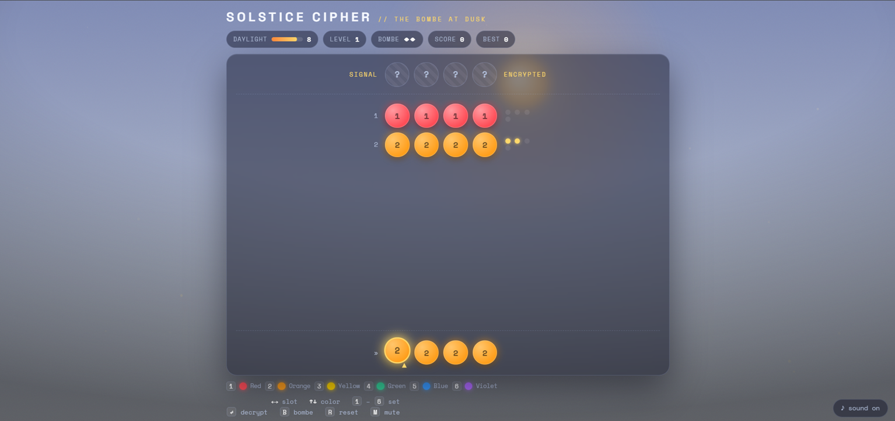

<div align="center">

# 🌞 SOLSTICE CIPHER

### Crack the light before the longest day ends.

A code-breaking deduction game about racing the dying light of the June solstice — and a love letter to **Alan Turing**.

[**▶ Play it now**](https://longphanquangminh.github.io/solstice-cipher/) · Built for the [DEV June Solstice Game Jam 2026](https://dev.to/challenges/june-game-jam-2026-06-03)

    



</div>

---

## About

A scrambled **light-signal** pulses over the horizon: six colors of the spectrum locked in a hidden order. Your job is to **decrypt the sequence before the sun sets**.

Every guess burns one hour of daylight — the sun slides down its arc, the sky bleeds from noon-blue to golden dusk to indigo night, and the stars come out. Crack the code and the beacon fires; run out of light and **darkness wins**.

The machine that grades your guesses is **The Bombe** — the device Alan Turing designed to break the Enigma cipher.

## Theme connection

| Thread | In the game |
| --- | --- |
| ☀️ **Solstice & passage of time** | Daylight is the resource. The sun, sky, and stars are all driven by how many guesses you've spent. |
| 🌗 **Light vs. darkness** | The literal win/lose condition — decrypt the signal, or let night fall. |
| 🧠 **Ode to Alan Turing** | June is Turing's birth month. Code-breaking _is_ the gameplay; the feedback engine is his Bombe. |
| 🏳️‍🌈 **Pride** | The signal you decode is the rainbow light spectrum — honoring Turing, persecuted for being gay. |

## Features

- 🎨 **Living sky** — a Canvas day/night cycle (sun arc, fading stars, drifting light-motes, a ghost moon) driven entirely by your remaining daylight.
- 🧩 **Real deduction** — a Mastermind-style cipher with duplicate colors and gold / hollow feedback pegs.
- ⚙️ **The Bombe Assist** — spend a charge to let Turing's machine lock one correct position (2 per level).
- 🔊 **Procedural audio** — retro machine tones via the Web Audio API (no sound files).
- 📈 **Endless ramp + scoring** — codes grow 4 → 5 → 6 symbols; high score saved locally.
- ⌨️ **Keyboard-first** and **colorblind-friendly** (every orb is numbered 1–6).
- 📦 **One file, zero dependencies, no build.**

## How to play

You're trying to match a hidden sequence of colored light-glyphs. After each guess, The Bombe tells you how close you are:

- 🟡 **Gold peg** — right color, **right** position
- ⚪ **Hollow peg** — right color, **wrong** position

Use the feedback to deduce the exact order before your daylight runs out.

### Controls (keyboard-first)

| Key               | Action                                       |
| ----------------- | -------------------------------------------- |
| `←` `→`           | Move the active slot                         |
| `↑` `↓`           | Cycle the color of the active slot           |
| `1`–`6`           | Set a color directly (auto-advances)         |
| `Enter` / `Space` | Decrypt (submit your guess)                  |
| `B`               | **Bombe Assist** — lock one correct position |
| `R`               | Reset the run                                |
| `M`               | Mute / unmute                                |

> Mouse and touch work too (click an orb to cycle it, click a color in the legend to set it), but the game is tuned for a laptop keyboard.

## Run it locally

No toolchain required — it's a single static file.

```bash
git clone https://github.com/longphanquangminh/solstice-cipher.git
cd solstice-cipher
# then just open the file:
open index.html        # macOS
# xdg-open index.html  # Linux
# start index.html     # Windows
```

Or serve it (recommended so `localStorage` high-scores persist):

```bash
python3 -m http.server 8000
# visit http://localhost:8000
```

## Deploy (GitHub Pages)

1. Make sure the game file is named **`index.html`** in the repo root.
2. **Settings → Pages → Build and deployment → Source: `Deploy from a branch`**, branch `main` / root.
3. Your game goes live at `https://longphanquangminh.github.io/solstice-cipher/`.

## Tech stack

- **HTML5 Canvas** — sky, sun, stars, particles, screen shake
- **DOM + CSS** — board, glassmorphism HUD, animations (Space Grotesk + Space Mono)
- **Web Audio API** — procedural sound effects
- **Vanilla JavaScript** — game logic, no framework

## Scoring

```
round score = level × 100  +  daylight saved × 15  +  Bombe charges held × 40
```

Your total carries across levels until night finally falls. Best score is stored in `localStorage`.

## Project structure

```
solstice-cipher/
├── index.html      # the entire game (markup, styles, logic)
├── gameplay.png    # screenshot for README / repo card
└── README.md
```

## Accessibility

- Fully playable with the keyboard alone.
- Every color glyph carries a number (1–6), so the puzzle is solvable without relying on hue.
- High-contrast HUD and large, glowing targets.

## License

[MIT](LICENSE) — free to play, fork, and learn from.

---

<div align="center">

Made for the **June Solstice Game Jam**. Happy solstice. 🌞

</div>
